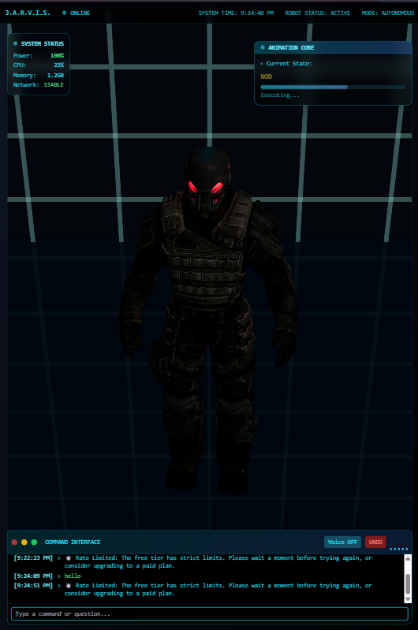

# Jarvis Robot Assistant System

A complete MVP Jarvis-style robot assistant system with Python FastAPI backend and React Three.js frontend.

## Features

- **Real-time WebSocket Communication**: Instant command transmission from backend to frontend
- **3D Robot Visualization**: Interactive 3D robot with smooth animations using React Three Fiber
- **Animation System**: Supports idle, wave, walk, nod, and custom animations with smooth transitions
- **Jarvis-style UI**: Futuristic HUD overlay with connection status, command logs, and system information
- **Auto-reconnection**: Robust WebSocket connection with automatic reconnection on failure

## Setup Instructions

### Backend (Python FastAPI)

1. **Install Python dependencies**:
   \`\`\`bash
   cd scripts
   pip install -r requirements.txt
   \`\`\`

2. **Start the backend server**:
   \`\`\`bash
   python backend_server.py
   \`\`\`
   
   Or use the convenience script:
   \`\`\`bash
   chmod +x start_backend.sh
   ./start_backend.sh
   \`\`\`

   The server will start on `http://localhost:8000`

### Frontend (React + Next.js)

1. **Install Node.js dependencies**:
   \`\`\`bash
   npm install
   \`\`\`

2. **Start the development server**:
   \`\`\`bash
   npm run dev
   \`\`\`

   The frontend will be available at `http://localhost:3000`

## Usage

### Automatic Demo
- The backend automatically sends commands every 5 seconds in this sequence:
  - `wave` (after 5s)
  - `walk` (after 10s) 
  - `nod` (after 15s)
  - Loop repeats

### Manual Commands
Send custom commands via REST API:

\`\`\`bash
curl -X POST http://localhost:8000/send-command \
  -H "Content-Type: application/json" \
  -d '{"command": "dance"}'
\`\`\`

### Available Endpoints
- `GET /` - Health check
- `GET /health` - System status
- `POST /send-command` - Send custom animation command
- `WS /ws` - WebSocket connection for real-time commands

## System Architecture

\`\`\`
┌─────────────────┐    WebSocket     ┌─────────────────┐
│   Python        │ ◄──────────────► │   React         │
│   FastAPI       │                  │   Three.js      │
│   Backend       │                  │   Frontend      │
│                 │                  │                 │
│ • WebSocket     │                  │ • 3D Robot      │
│ • REST API      │                  │ • Animations    │
│ • Auto Commands │                  │ • Jarvis UI     │
└─────────────────┘                  └─────────────────┘
\`\`\`

## File Structure

\`\`\`
├── scripts/
│   ├── backend_server.py      # FastAPI WebSocket server
│   ├── requirements.txt       # Python dependencies
│   └── start_backend.sh       # Backend startup script
├── app/
│   └── page.tsx              # Main React page
├── components/
│   ├── robot.tsx             # 3D Robot component
│   ├── robot-scene.tsx       # 3D Scene setup
│   └── jarvis-ui.tsx         # Jarvis-style UI overlay
├── hooks/
│   ├── use-websocket.ts      # WebSocket connection hook
│   └── use-animation-manager.ts # Animation state management
└── public/models/
    └── robot.glb             # 3D Robot model (with animations)
\`\`\`

## Troubleshooting

### Backend Issues
- **Port 8000 in use**: Kill existing processes or change port in `backend_server.py`
- **Dependencies missing**: Run `pip install -r requirements.txt`
- **Permission denied**: Use `chmod +x start_backend.sh`

### Frontend Issues
- **WebSocket connection failed**: Ensure backend is running on localhost:8000
- **3D model not loading**: Check that `robot.glb` exists in `public/models/`
- **Animations not working**: Verify the GLB model contains the required animation clips

### Network Issues
- **CORS errors**: Backend includes CORS middleware for localhost:3000
- **Firewall blocking**: Allow connections on ports 3000 and 8000
- **WebSocket upgrade failed**: Check browser console for detailed error messages

## Customization

### Adding New Animations
1. Add animation clips to your `robot.glb` model
2. Update the animation duration mapping in `use-animation-manager.ts`
3. Send commands with the new animation name

### Modifying UI Theme
- Edit color variables in `jarvis-ui.tsx`
- Customize the cyan/blue color scheme to match your preference
- Adjust transparency and glow effects

### Backend Commands
- Modify the demo loop in `backend_server.py`
- Add new REST endpoints for additional functionality
- Implement authentication or rate limiting as needed
